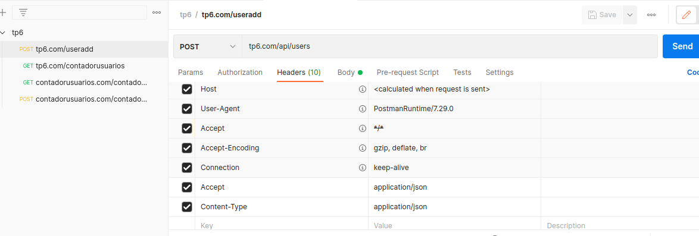
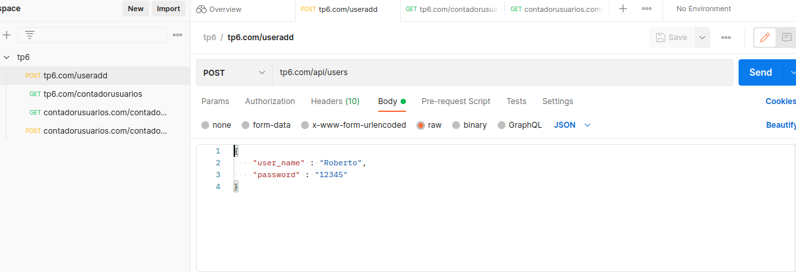

## Requerimientos

Se deben tener las siguientes herramientas instaladas para poder compilar y correr el programa.

- nginx
- curl
- system D
- logrotation
- Se recomienda instalar y usar Postman para las request.
- Si se desea correr este programa en la computadora local, es necesario tener instalado un [servidor SSH](https://phoenixnap.com/kb/ssh-to-connect-to-remote-server-linux-or-windows)

## Uso
Para compilar el programa es necesario hacerlo siempre con sudo ya que el programa guarda archivos y toca configuraciones que son de sudo.

~~~
sudo make config
sudo make
~~~

Luego, hay que usar el ejecutable ubicado en /usr/local tambien con privilegios de usuario para que pueda crear el usuario y ponerle contraseña.

~~~
sudo /usr/local/tp6_mascasariego/./creadorusuarios
sudo /usr/local/tp6_mascasariego/./contadorusuarios
~~~

Esto no setea al programa para ejecutarse con systemd, pero una vez se compila se pueden ejecutar manualmente los comandos para iniciarlo en systemd; ver la seccion de systemd para esto.

En este caso se uso el *Postman* para realizar las request, siempre con la cabecera application/json.
Se adjuntan ejemplos de configuracion para una de las solicitudes del postman:

Ademas, se adjunta un .json que tiene la coleccion de request utilizados en *Postman*. Esto puede ser importado en el programa para poder realizar la request.

Una vez se haya creado el usuario, se ejecuta el comando

~~~
ssh <nombreusuario>@<servidor>
~~~

Ej:

~~~
ssh Roberto@localhost
~~~

Para conectarse mediante otra computadora que esta en la misma red LAN, es tan simple como

~~~
ssh <usuario_a_conectar>@<ip_privada>
~~~

Una vez conectado mediante ssh, si se usa el comando **who** en la computadora servidor se puede ver la coneccion activa de ssh y la ip de origen de la coneccion.

### Contacto con los distintos servidores

- contadorusuarios.com/contador/value (GET) : devuelve la cantidad de usuarios que lista tp6.com/api/users. En caso de borrar usuarios este servicio **no actualiza su contador** a menos que se reinicie el servicio de contador.
- contadorusuarios.com/contador/increment (POST) : es posible llamar a este servicio para incrementar su contador sin crear un nuevo usuario.
- tp6.com/api/users (GET): lista todos los usuarios a partir del ID 1000. Esto puede causar que se listen otros usuarios que estan presentes debido a la instalacion de otros programas, pero es la unica forma que se me ocurrio de que los usuarios listados perduren a pesar de que se caiga el servicio. Si no se lee directamente desde passw y se guarda en un log no se asegura que los usuarios sean realmente esos.
- tp6.com/api/users (POST) : crea un nuevo usuario. En caso de que no sea posible crearlo, devuelve un mensaje.

## Configuracion del nginx

Para instalar nginx se debe seguir las instrucciones presentes en [nginx](https://nginx.org/en/linux_packages.html)

Primero se entra a /etc/nginx/sites-available y se debe crear 1 archivo por cada servidor que se desea hacer.

~~~
cd /etc/nginx/sites-available
cp default tp6.com
cp default contadorusuarios.com 
~~~

En este caso se creo el archivo tp6.com y contadorusuarios.com copiando el archivo que viene por defecto y luego modificando estos dos archivos segun se desea. Luego de configurar para cada archivo el nombre del servidor y el puerto al que escucha(que va a ser el puerto 80) y de configurar de donde saca su index.html, se le configura el proxy pass, para redireccionar las rutas a los endpoints de ulfius.
Una vez hecho esto se debe configurar estos mismos archivos como links simbolicos dentro de la carpeta sites-enabled, que se hace con el comando

~~~
cd sites-enabled
ln -s ../sites-available/tp6.com
ln -s ../sites-available/contadorusuarios.com
~~~

Luego se cargan las configuraciones de nginx con 

~~~
nginx -s reload
~~~

Ademas se le debe decir al host local que cuando intente resolver los nombres de **tp6.com** y **contadorusuarios.com** los redireccione a la direccion de loopback, eso se hace con el comando

~~~
nano /etc/hosts
~~~

Y luego escribe manualmente el dominio y la direccion a la que se lo quiere asociar.

Fuentes:

[Config inicial de nginx y de sus servidores](https://www.youtube.com/watch?v=_LQv96MdtCk)

[Proxy pass](https://www.youtube.com/watch?v=fVM658GMbTo)

## Configuracion del logrotation

Se creo un archivo dentro de la carpeta conf llamado tp6_mascasariego_2022 que es la configuracion necesaria para el logrotation. Este archivo es copiado en /etc/logrotate.d, y cuando el sistema operativo realice un logrotation programado, va a ejecutar la configuracion copiada. Esta configuracion rota el log guardado en /var/log/tp6_mascasariego_2022.
La creacion de las carpetas necesarias y de la configuracion es realizada por el makefile, ejecutando el comando:

~~~
make config
~~~
**Es posible que se deba usar esto con privilegios de sudo**

Para forzar una rotacion de log en debug:

~~~
sudo logrotate /etc/logrotate.conf --debug
~~~

Los logs son guardados en **/var/log/tp6_mascasariego_2022**.

Fuentes:

[Logrotate](https://www.digitalocean.com/community/tutorials/how-to-manage-logfiles-with-logrotate-on-ubuntu-16-04)

[Video explicacion](https://www.youtube.com/watch?v=SI3rHpVXrdc)

## Configuracion de systemd

Se crearon 2 nuevos archivos de servicio que son los que toma el systemd para iniciar los programas.
Estos dos archivos se copian mediante el makefile en **/etc/systemd/system** con lo que ahora systemd 
sabe que archivo de configuracion abrir para iniciar los programas. 
Los ejecutables deben estar en una carpeta que este presente en todos los linux, por lo que se eligio poner los ejecutables en **/usr/local** y crear ahi una carpeta para guardar los ejecutables.

Una vez puestos los ejecutables en /usr/local y los archivos de configuracion en /etc/systemd/system, se usaran 4 comandos para manejar el servicio

- systemctl start <nombre_servicio> -> este comando inicia el servicio
- systemctl stop <nombre_servicio> -> detiene el servicio
- systemctl enable <nombre_servicio> -> habilita el servicio para que se inicie al encender la computadora
- systemctl disable <nombre_servicio> -> deshabilita el servicio y ya no es ejecutado al inicio de la computadora

Es posible usar el comando **systemctl status <nombre_servicio>** te muestra info sobre el servicio

Los nombres de los servicios es 
- contadorusuarios_mascasariego
- creadorusuarios_mascasariego

Fuentes:
[systemd](https://www.youtube.com/watch?v=unIAGt5pB7A)
